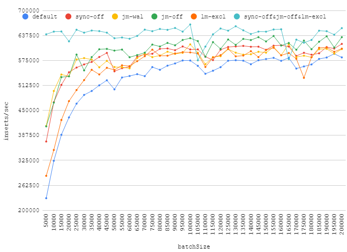

# benchmark-sqlite3-bulk-insert

## Usage:

`PS> .\BenchApp.exe --help`
```
Benchmark of sqlite3 bulk inserts with different pragmas.

-i|--batchSizeIncrement Optional with default '5000'. Growth of 'batchSizeBase'
                        parameter in each test set run.
-b|--batchSizeBase      Optional with default '5000'. Minimal number of inserts
                        in a transaction, will be incremented by
                        'batchSizeIncrement' in each test set run.
-t|--tableCount         Optional with default '10'. Number of tables to use for
                        inserts.
-s|--string             Optional with default 'string'. Value to insert (along
                        with sequential integer primary key).
-r|--rowCount           Optional with default '5000000'. Total number of rows
                        to insert in each test.
-n|--number             Optional with default '40'. Number of test set runs.
```


## Publish, Run with default parameters, Clean-up artifacts:
`PS> ./publish-run-cleanup.ps1`

```
batchSize;default;sync-off;jm-wal;jm-off;lm-excl;sync-off&jm-off&lm-excl
5000;230199.4909248754;372049.2937931448;411049.68302438065;409966.3206108158;286200.2799565347;640252.4623021272
10000;323807.91685876844;470368.9083592768;498534.5079603996;469344.58038144535;350863.97587492986;647046.8683869789
15000;388874.0328714481;513815.1574710247;539691.7514096166;533143.344313738;425959.69080767134;647375.2304127681
20000;432370.09261133906;545336.4830805212;535407.5335287992;535123.3566361718;473108.8210562493;622733.0415563334
25000;466852.1875012839;557086.2676831159;577378.5064268868;589642.889623757;500884.09549042734;651746.435390186
30000;488678.6070606857;564990.6536591296;580847.2681469984;549976.6911485073;525843.7416253048;644452.6595623052
35000;498493.4064868897;571253.796337792;577248.9330970462;583273.985889863;551536.7539598425;649737.2165934832
40000;512704.3629336566;583547.4651030739;557710.0390104788;602854.6978507326;539869.0951331838;648294.1487926352
45000;525241.1661375979;593803.5158731705;573821.6827351289;603830.5997799181;556563.4609703271;644476.1382484022
50000;502570.2750549023;547688.6591084244;558417.1456043;599571.3328781308;551083.3124114553;630515.0123543743
55000;532275.5380345981;555498.4034358665;557994.1968603526;602117.2852217538;562738.0253952416;632292.738304395
60000;536008.7041786151;559098.8601748089;555181.309841271;582991.4082870402;560885.6460938617;629225.3174997669
65000;540632.1208651178;584732.8017299379;580885.7406919939;588314.1890259206;573045.3946493453;636275.1351057477
70000;535629.4687340254;590160.0302636914;591794.917079411;594346.6038054447;585449.2927525172;652026.164747333
75000;558305.9486145356;591615.1637779016;583242.2758603763;614632.6832158566;601890.7248055656;648067.5979280219
80000;551528.3974966571;603997.5970637534;587229.6841763917;609857.5580538595;586674.1786194829;653714.5172557503
85000;561866.3325921142;604867.3714185396;596841.4472656925;618785.9006431922;586768.3801684;651443.1321924921
90000;567389.5633813516;600472.4225882781;591312.0844838036;612823.2560656472;592504.913391881;656179.3650254357
95000;574852.6183780383;609937.7478273376;594039.6514492788;626102.7297698794;595667.1173881189;647035.5894198208
100000;574698.7782444193;602458.7643483989;615137.6518128968;630620.5395657443;595031.6546724748;664937.6868275419
105000;561448.2338186722;602591.8335606921;594342.1660728585;623337.7895775067;592235.9984729312;575179.692079912
110000;541583.6516486688;584273.7721345037;565556.6279169355;584243.2774843972;558642.6739080601;609620.0031618958
115000;549182.7222651037;575837.2405646535;583417.0872116756;620759.3241031882;582260.8400689844;640259.4660225696
120000;558061.8114026253;601730.8420763277;585563.133744893;603947.8376144827;588222.1920379751;654838.7787592182
125000;574220.4905161399;608575.6981994242;603275.6589335696;627318.955090876;603850.0245712614;649408.6238296131
130000;575494.1295696142;609869.7217041005;594372.6339096278;613887.8608062214;585218.5544893206;660517.0655949069
135000;574349.8991558863;611322.3583081138;589415.0265313463;628835.3052387345;587093.284809378;650301.0985219444
140000;565395.7428077536;609142.8462599786;590421.448252;625905.2633880881;598071.6485685101;641094.5729499618
145000;575471.345174775;609371.2572877805;596658.0829796965;633159.9532468526;583370.8540584804;647087.6154925061
150000;578431.056124663;601595.5041977998;594373.8659166525;622433.4052841201;600831.2664434317;646881.036943768
155000;581477.8484606828;611907.3418320684;608668.4200244057;636125.2992418053;606747.6528804996;652391.4216473233
160000;573973.5157742099;612884.5785858771;588006.9323646331;612262.1619181848;587705.1258254754;652881.4865174248
165000;581295.1890953251;609678.261819346;615761.5475722258;618664.717068752;593489.0296850024;578312.7733017084
170000;554607.1984954464;586310.0271609012;583375.6448312516;601759.2976236184;579039.8633475319;627006.2052374961
175000;559913.958821825;594040.6904779836;586856.9130624541;624629.8510427348;531468.1015611247;619257.7899660069
180000;564918.9121670352;589315.441845861;582756.0680824562;603030.0398297618;583145.9866861292;626253.7881105873
185000;578701.7325391438;592757.1836355821;603077.1204155334;621789.7923527076;606568.5066789751;649407.5504971251
190000;582267.6470089378;608425.7032960822;604135.3184844862;635397.3074408845;607592.2140181831;648158.9811696565
195000;591594.5087214743;604600.2451390451;591864.4246575163;607290.6267463499;596597.2296839369;639445.5253077783
200000;582600.0777305024;616341.8910596971;603319.1458009646;633193.1713814315;604468.816197269;655791.0024503893
```

## Chart




## Info:

  * https://sqlite.org/pragma.html
  * https://stackoverflow.com/Questions/364017/faster-bulk-inserts-in-sqlite3

## Contribute:

  * multi-threaded scenario
  * bulk insert with virtual function
  * bulk insert with in-memory DB backup into real DB
  * automatic cleanup during tests run
